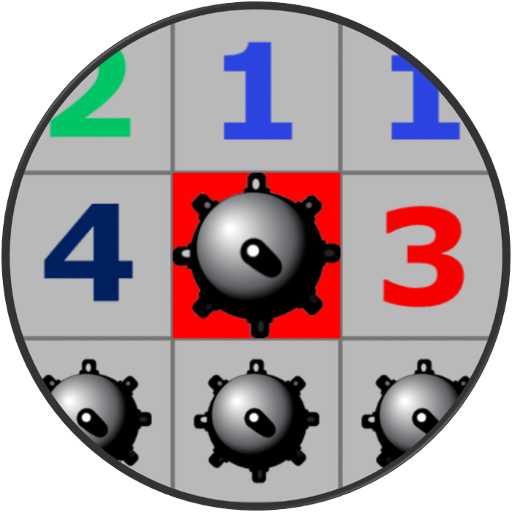

# 💣 Campo Minado - PyQt6

Bem-vindo ao **Campo Minado**, um clássico jogo de lógica agora com uma interface moderna e elegante usando **Python + PyQt6**!  
Você pode escolher entre **3 tamanhos de tabuleiro** e testar sua habilidade em escapar das bombas.

  

---

## Executáveis para download

- [Executável Windows (CampoMinado.exe)](https://github.com/SabrinaBruni28/JogoCampoMinado-2.0/actions/runs/16603278190/artifacts/3641494300)
- [Executável Linux (CampoMinado)](https://github.com/SabrinaBruni28/JogoCampoMinado-2.0/actions/runs/16603278190/artifacts/3641495623)
- [Executável macOS (CampoMinado)](https://github.com/SabrinaBruni28/JogoCampoMinado-2.0/actions/runs/16603278190/artifacts/3641494096)

---

## 🎮 Funcionalidades

✅ Interface gráfica com PyQt6  
✅ Modos de tabuleiro:  
- 🟦 **8x8** (fácil)  
- 🟪 **10x10** (médio)  
- 🟥 **16x16** (difícil)  

✅ Modo de marcação com bandeira 🚩  
✅ Detecção de vitória ou derrota  
✅ Tela de fim de jogo com botão para reiniciar   

---

## 🧠 Como Jogar

1. **Escolha o tamanho do tabuleiro.**
2. Clique nos blocos para revelar o espaço.
3. Se encontrar uma bomba 💣, você perde!
4. Use o botão 🚩 para marcar locais suspeitos de conter bombas ou retirar marcação.
5. Revele todos os blocos seguros para vencer! 🎉

---

## 🧩 Estrutura

- `Jogo/campo_minado.py`: Lógica principal do jogo
- `Jogo/view_utils.py`: Utilitários de UI
- `Jogo/interface.py`: Interface gráfica principal
- `Images/`: Pasta com imagens utilizadas no jogo

---

## 💡 Inspiração

Este projeto foi desenvolvido para treinar habilidades com interfaces gráficas e lógica de jogos.  
Ideal para aprender manipulação de eventos, layouts em PyQt6 e lógica de jogo em grade.

---
## 🧑‍💻 Autor

Desenvolvido por [Sabrina Bruni](https://github.com/SabrinaBruni28)

